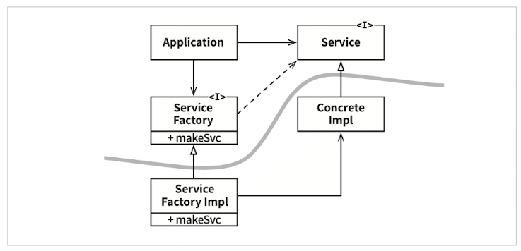

# 의존성 역전 원칙 (DIP)

## 안정화된 추상화

1. > 변동성이 큰 구체 클래스를 참조하지 말라. 
   >   대신 추상 인터페이스를 참조하라. 
   >   이 규칙은 언어가 정적 타입이든 동적 타입이든 관계 없이 모두 적용된다.
   >   이 규칙은 객체 생성 방식을 강하게 제약하며, 일반적으로 추상팩토리(Abstract Factory)를 사용하도록 강제한다.

2. > 변동성이 큰 구체 클래스로부터 파생하지 말라.
   >   정적 타입 언어에서 상속은 소스 코드에 존재하는 모든 관계 중에서 가장 강력한 동시에 뻣뻣해서 변경하기 어렵다
   >   따라서 상속은 아주 신중하게 사용해야 한다.

3. > 구체 함수를 오버라이드 하지 말라.
   >   대체로 구체 함수는 소스 코드 의존성을 필요로 한다.
   >   따라서 구체 함수를 오버라이드 하면 이러한 의존성을 제거할 수 없게 되며, 실제로는 그 의존성을 상속하게 된다.
   >   이러한 의존성을 제거하려면, 차라리 추상 함수로 선언하고 구현체들에서 각자의 용도에 맞게 구현해야 한다.

4. > 구체적이며 변동성이 크다면 절대로 그 이름을 언급하지 말라.

## 팩토리

 그림 11.1 의존성을 관리하기 위해 추상 팩토리(Abstract Factory) 패턴을 사용

> 그림 11.1의 곡선은 아키텍처 경계를 뜻하며, 이 곡선은 구체적인 것들로부터 추상적인 것들을 분리한다.
>   소스 코드 의존성은 해당 곡선과 교차할 때 모두 한 방향, 즉 추상적인 쪽으로 향한다.
>   곡선은 시스템을 두가지 컴포넌트로 분리한다.
>   하나는 추상 컴포넌트이며, 다른 하나는 구체 컴포넌트다.
>   추상 컴포넌트는 업무 규칙을 다루기 위해 필요한 모든 세부사항을 포함한다.
>   제어 흐름은 소스 코드 의존성과 정반대 방향으로 곡선을 가로지른다는 점을 주목하며, 제어 흐름과는 반대 방향으로 역전된다.
>   이러한 이유로 이 원칙을 의존성 역전(Dependency Inversion)이라 한다.

> Application은 example.Service 인터페이스를 통해 ConcreteImpl을 사용하지만, Application에서는 어떤 식으로든 ConcreteImpl의 인스턴스를 생성해야 한다.
>   ConcreteImpl에 대해 소스 코드 의존성을 만들지 않으면서 이 목적을 이루기 위해 Application은 example.ServiceFactory 인터페이스의 makeSvc 메서드를 호출한다.
>   이 메서드는 ServiceFactory로부터 파생된 ServiceFactoryImpl에서 구현된다.
>   그리고 example.ServiceFactoryImpl 구현체가 ConcreteImpl의 인스턴스를 생성한 후 example.Service 타입으로 반환한다.