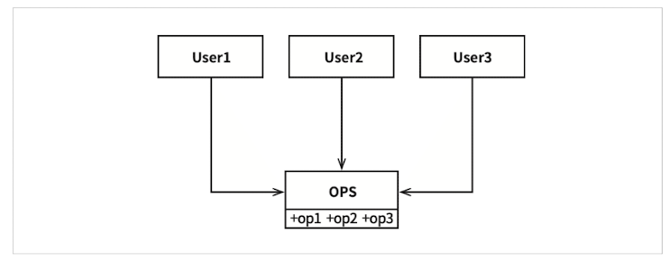
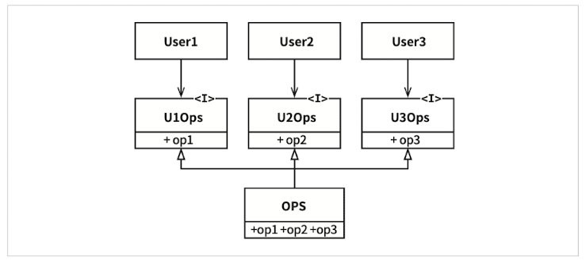
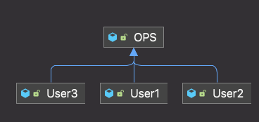
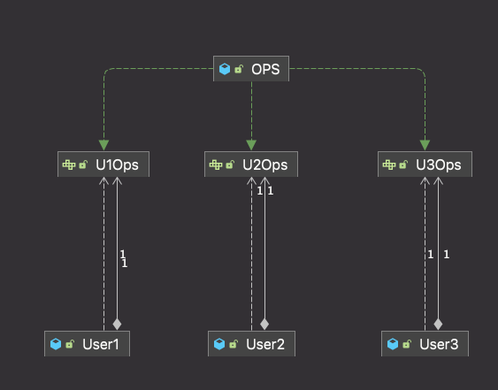
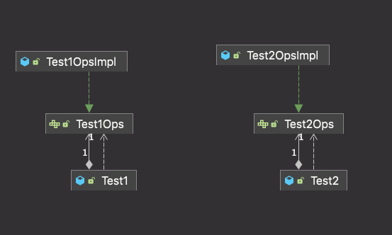

# 인터페이스 분리 원칙(ISP)

그림 10.1 인터페이스 분리 원칙

다수의 사용자가 isp.OpsImpl 클래스의 오퍼레이션을 사용한다.

User1은 오직 op1을, User2는 op2만을, User3는 op3만을 사용한다고 가정해보자.

그리고 OPS가 정적 타입 언어로 작성된 클래스라고 한다면, 이 경우 User1에서는 op2, op3를 전혀 사용하지 않음에도 User1의 소스 코드는 이 두 메서드에 의존하게 된다.

이러한 의존성으로 인해 isp.OpsImpl 클래스에서 op2의 소스 코드가 변경되면 User1도 다시 컴파일한 후 새로 배포해야 한다.

사실 User1과 관련된 코드는 전혀 변경되지 않았음에도 말이다.

다음과 같이 OPS를 분리하게 되면 의존성을 제거할 수 있다.

그림 10.2 분리된 오퍼레이션

User1의 소스 코드는 U1Ops와 op1에는 의존하지만 OPS에는 의존하지 않게 된다.

따라서 OPS에서 발생한 변경이 User1과는 전혀 관계없는 변경이라면, User1을 다시 컴파일하고 새로 배포하는 상황은 초래되지 않는다.

> not 패키지 UML
>   

> isp 패키지 UML
>   

> example 패키지 UML
>   
